# Flashing guide by example

## 1. Preparing the RF bridge
Overview: expose the PCB of the RF bridge and erase the onboard ESP8256


### Packaging

Example of what the packaging back and front looks like.

 

Take note of the **Model** field. If it indicates version R2, only once the PCB is removed from the casing will you be able to identify the version if R2 2.2 or R2 1.0 [See all versions](https://tasmota.github.io/docs/devices/Sonoff-RF-Bridge-433/). This guide shows the R2 2.2. 


### Prepare the PCB

Remove the PCB from the housing, this is achieved by removing the rubber feet first.  Using your finger nail pry underneath the recessed glued in-place feet.  It can be tricky, alternatively you can use a plastic disassembly spatula to remove the feet.  The glue stays intact on the rubber feet and can be re-used later during the re-assembly.

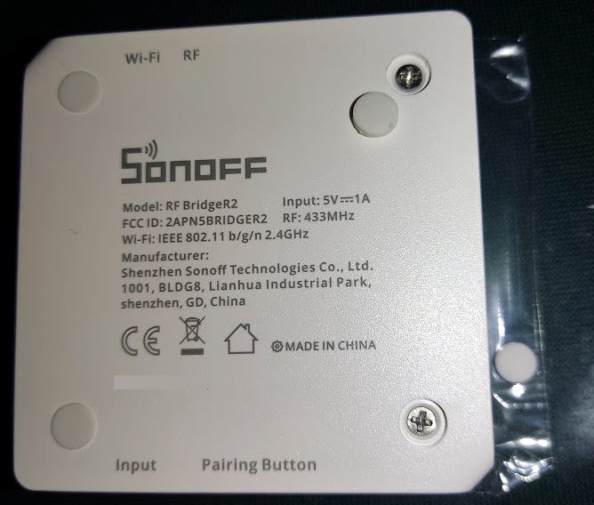 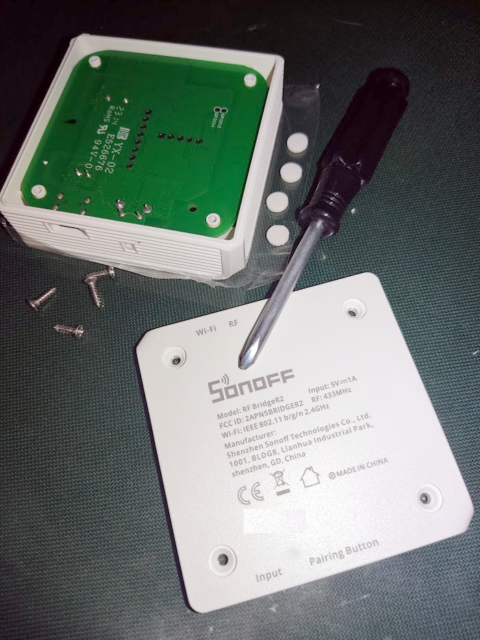 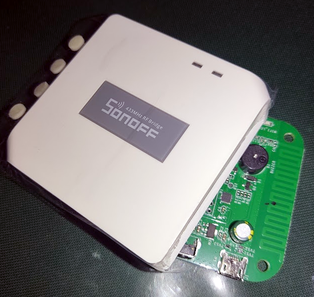

For safe keeping stick the feet to the plastic cover overhanging the top of the unit, that way they won't get lost. The best way to remove the PCB is to just flip over the entire housing and let it drop out, keep it low over the table or your hand to prevent it from damaging.


### Erasing the ESP8256 of the PCB of the RFbridge (recommended)

Next erase the ESP8256 on the RF bridge, this serves a dual purpose. 
a) Reduce power consumption during MCU flashing 
b) Prevent ESP interference with the MCU flashing as it has no code on it at start-up

Note: Some users reoprted success flashing the radio chip on V2.2 RF bridge without erasing the ESP8256. However, the bridge's ESP was already flashed with ESPHome. It is nonetheless recommended to erase the bridge's ESP if you're coming from stock firmware or flashing passthrough firmware to the radio chip.

1) Connect the ESP8256 to a **USB to serial adapter (FTDI)**  to the ESP using 4 breadboard wires to the existing holes. For a more secure and permanent solution you can solder headers to the green PCB and connect the breadboard wire to it. *Please note without headers electrical glitches may occur with dangling wires and may cause failed flashing.*

Wires to connect: *3V3, TX, RX and GND*
| External FTDI  | ESP8256 (J2) | 
| ------------- | ------------- |
| 3V3  | 3V3  |
| TX  | RX  |
| RX | TX  |
| GND  | GND  |


2) Before powering the **USB to serial adapter**, press and hold the button on the RFbridge's PCB, only release it after the **USB to serial adapter**  is plugged into the computer.

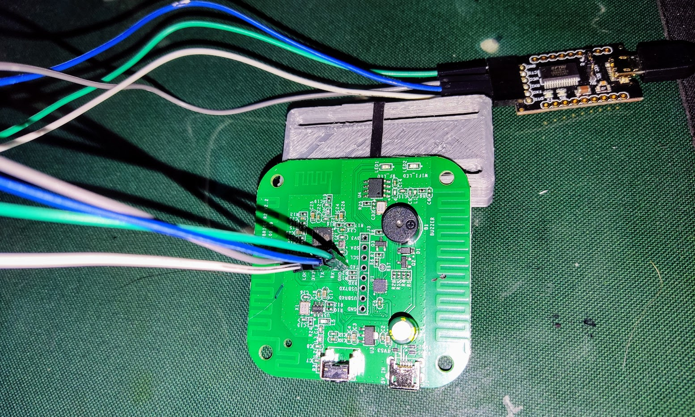 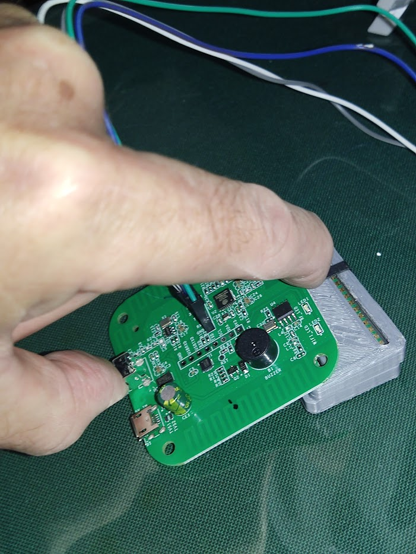

3) Use **esptool** to erase the ESP

```
esptool.py --chip auto --port /dev/cu.usbserial-A904SFSD erase_flash
esptool.py v4.7.0
Serial port /dev/cu.usbserial-A904SFSD
Connecting....
Detecting chip type... Unsupported detection protocol, switching and trying again...
Connecting...
Detecting chip type... ESP8266
Chip is ESP8285N08
Features: WiFi, Embedded Flash
Crystal is 26MHz
MAC: 80:64:6f:b4:75:11
Uploading stub...
Running stub...
Stub running...
Erasing flash (this may take a while)...
Chip erase completed successfully in 1.7s
Hard resetting via RTS pin...
```
Alternatively, https://web.esphome.io/ can be used to erase the ESP, but this will write a very basic version of ESPHome on the bridge and did not cause problems for some testers.

## Prepare external flasher for the RF chip 
1) Grab an empty Wesmos D1 board (or 8266 NodeMCU or Arduino boards)
2. Download the current source code, open "OnbrightFlasher.ino" into arduino IDE, and then compile and upload it to the external flasher (**Wesmos D1**)
3. Done


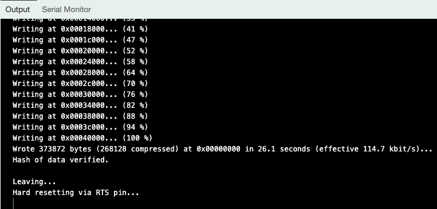

## Erasing the MCU (RF chip) on the PCB

1) Prepare the MCU for flashing by wiring it to the **WeMos D1** as follow. 
 
| RF chip OB38S003 (J3) | External flasher (Wesmos D1) | 
| ------------- | ------------- |
| SCL  | SCL  |
| SDA | SDA  |
| GND  | GND  |
| 3V3  | 3V3 (leave it disconnected till step 2) |

**Stay away from the 5V line, do not connect to the 5V line on your WeMos D1.**

I have had success not connecting the 3V3 wire and instead powering the RF chip by powering the RFbridge using its microUSB when prompted. 

See [pinouts](https://randomnerdtutorials.com/esp8266-pinout-reference-gpios/) if using NodeMCU board instead of Wesmos D1.

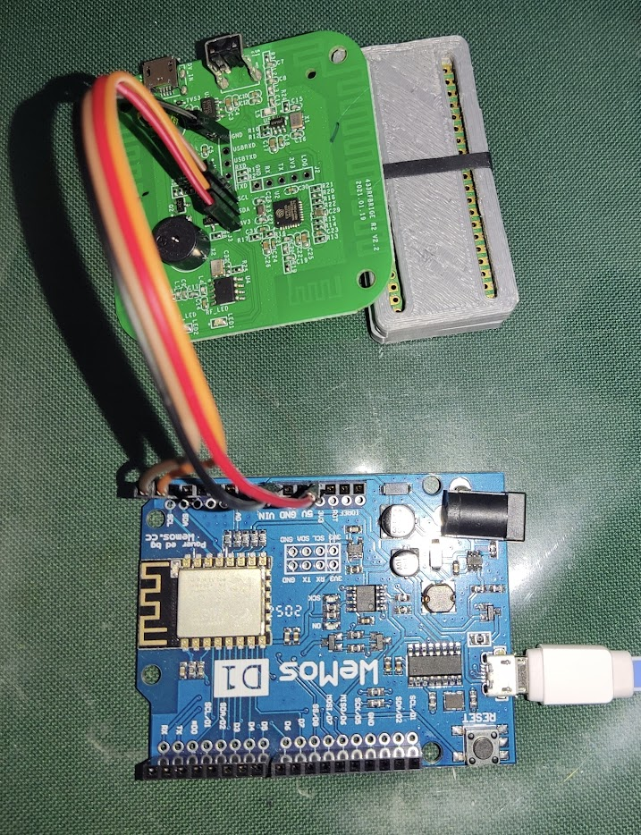


2) With Wemos D1 connected to the PC (and 3V3 wire not yet connected), in the Arduino IDE serial monitor, issue the ```handshake``` command
3) When prompted, then put the red cable back into the **WeMos D1** 3V3 pin.

**Note**: The handshake should succeed but you might get **chip type might be wrong**; this seems to be the case with new/fresh boards only. **IGNORE THE INCORRECT CHIP TYPE AND CONTINUE TO ATTEMPT AND ERASE THE CHIP.**

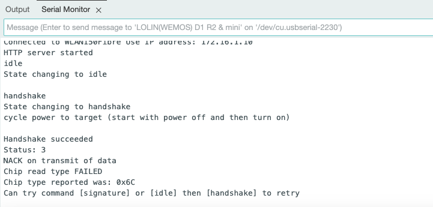


4) Issue the chip ```erase``` command which should complete as successful.

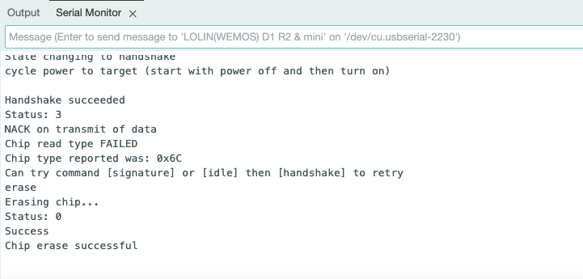


5) Then request again for the chip type by issuing the ```signature``` command, it should now report correctly.

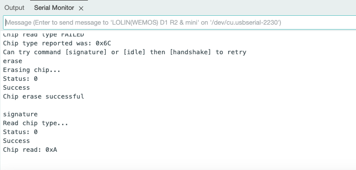


We are now ready to proceed and flash the MCU with the [custom firmware](https://github.com/mightymos/RF-Bridge-OB38S003/).


## Flashing the custom firmware to the MCU (radio chip)
1) Now we can flash the MCU with the new [custom firmware](https://github.com/mightymos/RF-Bridge-OB38S003/), please [download](https://github.com/mightymos/RF-Bridge-OB38S003/releases/) and add the .hex files in the **OnbrightFlasher** folder.

2) Remove the power e.g. red wire from the **WeMos D1** in preparation for a MCU handshake.

3) From the OS command line (linux/windows/etc), execute the ```flashScript.py``` script.  In the example below, we selected the comm port and the *passtroughmode* firmware.

4) Apply power to the MCU let it flash.

```python3 flashScript.py
Available COM ports:
1. /dev/cu.wlan-debug - n/a
2. /dev/cu.Bluetooth-Incoming-Port - n/a
3. /dev/cu.usbserial-2230 - USB2.0-Ser!
Select a COM port (enter the number): 3
2024-04-08 11:30:36,057 - INFO - Serial connection opened on /dev/cu.usbserial-2230
Select a file by number:
1. RF-Bridge-OB38S003_PassthroughMode.hex
2. blink.ihx
3. RF-Bridge-OB38S003_SerialMode.hex
Enter the number of the file you want to select: 1
2024-04-08 11:30:39,977 - INFO - You selected: /Users/username/Documents/GitHub/OnbrightFlasher/RF-Bridge-OB38S003_PassthroughMode.hex
2024-04-08 11:30:41,087 - INFO - handshake
2024-04-08 11:30:41,088 - INFO - State changing to handshake
2024-04-08 11:30:41,089 - INFO - cycle power to target (start with power off and then turn on)
2024-04-08 11:30:46,240 - INFO - Handshake succeeded
2024-04-08 11:30:46,360 - INFO - Status: 0
2024-04-08 11:30:46,361 - INFO - Success
2024-04-08 11:30:46,363 - INFO - Chip read: 0xA
2024-04-08 11:30:46,363 - INFO - Connected...
2024-04-08 11:30:46,367 - INFO - Returning to idle state...
2024-04-08 11:30:46,470 - INFO - erase
2024-04-08 11:30:46,975 - INFO - Erasing chip...
2024-04-08 11:30:46,976 - INFO - Status: 0
2024-04-08 11:30:46,976 - INFO - Success
2024-04-08 11:30:46,976 - INFO - Chip erase successful
2024-04-08 11:30:47,082 - INFO - 
2024-04-08 11:30:47,586 - INFO - setfuse 18 249
2024-04-08 11:30:48,090 - INFO - Set configuration byte...
2024-04-08 11:30:48,090 - INFO - Status: 0
2024-04-08 11:30:48,091 - INFO - Success
2024-04-08 11:30:48,091 - INFO - Wrote configuration byte
2024-04-08 11:30:48,102 - INFO - :10006800AE82AF837C007D00C3EC9EED9F50147A76
2024-04-08 11:30:48,139 - INFO - Write successful
2024-04-08 11:30:48,142 - INFO - Wrote 16 bytes
2024-04-08 11:30:48,150 - INFO - :100078000B7B001ABAFF011BEA4B70F70CBC00E8B7
2024-04-08 11:30:48,190 - INFO - Write successful
2024-04-08 11:30:48,193 - INFO - Wrote 16 bytes
2024-04-08 11:30:48,201 - INFO - :100088000D80E522AE82AF837C007D00C3EC9EED3F
2024-04-08 11:30:48,238 - INFO - Write successful
2024-04-08 11:30:48,241 - INFO - Wrote 16 bytes
2024-04-08 11:30:48,249 - INFO - :100098009F50147A957B051ABAFF011BEA4B70F73B
2024-04-08 11:30:48,287 - INFO - Write successful
2024-04-08 11:30:48,290 - INFO - Wrote 16 bytes
2024-04-08 11:30:48,298 - INFO - :1000A8000CBC00E80D80E522758E0022758E50226A
2024-04-08 11:30:48,335 - INFO - Write successful
2024-04-08 11:30:48,338 - INFO - Wrote 16 bytes
2024-04-08 11:30:48,345 - INFO - :1000B80075F75575F7AA75F75A43B6202275B755DF
2024-04-08 11:30:48,385 - INFO - Write successful
2024-04-08 11:30:48,387 - INFO - Wrote 16 bytes
2024-04-08 11:30:48,400 - INFO - :1000C8002253D3FE43D20153D57F43D48053DBFE62
2024-04-08 11:30:48,441 - INFO - Write successful
2024-04-08 11:30:48,444 - INFO - Wrote 16 bytes
2024-04-08 11:30:48,452 - INFO - :1000D80043DA0122439180D29E43878043D9107529
2024-04-08 11:30:48,490 - INFO - Write successful
2024-04-08 11:30:48,493 - INFO - Wrote 16 bytes
2024-04-08 11:30:48,501 - INFO - :1000E800BA0375AACC22D2AC2243C9202253C9DF55
2024-04-08 11:30:48,539 - INFO - Write successful
2024-04-08 11:30:48,541 - INFO - Wrote 16 bytes
2024-04-08 11:30:48,549 - INFO - :1000F8002243C9202243890143D901758CC1758ADD
2024-04-08 11:30:48,587 - INFO - Write successful
2024-04-08 11:30:48,590 - INFO - Wrote 16 bytes
2024-04-08 11:30:48,598 - INFO - :100108007FD2A9D28C2243891043D904758DFF75FB
2024-04-08 11:30:48,635 - INFO - Write successful
2024-04-08 11:30:48,637 - INFO - Wrote 16 bytes
2024-04-08 11:30:48,645 - INFO - :100118008B5FD2ABD28E2275C16075C8D122A2AFD7
2024-04-08 11:30:48,683 - INFO - Write successful
2024-04-08 11:30:48,686 - INFO - Wrote 16 bytes
2024-04-08 11:30:48,694 - INFO - :10012800E433F58222AE82AF838F8C8E8A22AE8230
2024-04-08 11:30:48,731 - INFO - Write successful
2024-04-08 11:30:48,733 - INFO - Wrote 16 bytes
2024-04-08 11:30:48,741 - INFO - :10013800AF838F8D8E8B2285C2822285C382225304
2024-04-08 11:30:48,779 - INFO - Write successful
2024-04-08 11:30:48,781 - INFO - Wrote 16 bytes
2024-04-08 11:30:48,787 - INFO - :07014800C9FD22858182221E
2024-04-08 11:30:48,807 - INFO - Write successful
2024-04-08 11:30:48,808 - INFO - Wrote 7 bytes
2024-04-08 11:30:48,814 - INFO - :03000000020006F5
2024-04-08 11:30:48,820 - INFO - Write successful
2024-04-08 11:30:48,823 - INFO - Wrote 3 bytes
2024-04-08 11:30:48,829 - INFO - :09005F0075080075090002000398
2024-04-08 11:30:48,851 - INFO - Write successful
2024-04-08 11:30:48,853 - INFO - Wrote 9 bytes
2024-04-08 11:30:48,858 - INFO - :0300030002019067
2024-04-08 11:30:48,865 - INFO - Write successful
2024-04-08 11:30:48,868 - INFO - Wrote 3 bytes
2024-04-08 11:30:48,876 - INFO - :10014F0022D28090001412008CC28022D2B0900371
2024-04-08 11:30:48,914 - INFO - Write successful
2024-04-08 11:30:48,917 - INFO - Wrote 16 bytes
2024-04-08 11:30:48,924 - INFO - :10015F00E812008CC2B0D2B09003E812008CC2B08B
2024-04-08 11:30:48,962 - INFO - Write successful
2024-04-08 11:30:48,964 - INFO - Wrote 16 bytes
2024-04-08 11:30:48,973 - INFO - :10016F00227F01C3E5A19F4017D2B09003E8C007DB
2024-04-08 11:30:49,012 - INFO - Write successful
2024-04-08 11:30:49,015 - INFO - Wrote 16 bytes
2024-04-08 11:30:49,022 - INFO - :10017F0012008CC2B09003E812008CD0070F80E3FE
2024-04-08 11:30:49,060 - INFO - Write successful
2024-04-08 11:30:49,062 - INFO - Wrote 16 bytes
2024-04-08 11:30:49,070 - INFO - :10018F00221200B01200C9C2B0C280C2871200DCB6
2024-04-08 11:30:49,109 - INFO - Write successful
2024-04-08 11:30:49,111 - INFO - Wrote 16 bytes
2024-04-08 11:30:49,119 - INFO - :10019F00D29C1200EE12010ED2ABC29712015B90ED
2024-04-08 11:30:49,157 - INFO - Write successful
2024-04-08 11:30:49,159 - INFO - Wrote 16 bytes
2024-04-08 11:30:49,167 - INFO - :1001AF0001F412008C1200B81200C5AF08A296E439
2024-04-08 11:30:49,206 - INFO - Write successful
2024-04-08 11:30:49,209 - INFO - Wrote 16 bytes
2024-04-08 11:30:49,217 - INFO - :1001BF0033F508EFB50802800AE5086004D2908095
2024-04-08 11:30:49,254 - INFO - Write successful
2024-04-08 11:30:49,257 - INFO - Wrote 16 bytes
2024-04-08 11:30:49,264 - INFO - :1001CF0002C290AF09A291E433F509EFB50902809D
2024-04-08 11:30:49,303 - INFO - Write successful
2024-04-08 11:30:49,306 - INFO - Wrote 16 bytes
2024-04-08 11:30:49,313 - INFO - :0D01DF00D7E5096004D28780CFC28780CBAE
2024-04-08 11:30:49,344 - INFO - Write successful
2024-04-08 11:30:49,346 - INFO - Wrote 13 bytes
2024-04-08 11:30:49,353 - INFO - :06003500E478FFF6D8FD9F
2024-04-08 11:30:49,367 - INFO - Write successful
2024-04-08 11:30:49,369 - INFO - Wrote 6 bytes
2024-04-08 11:30:49,376 - INFO - :100013007900E94400601B7A009001EC780175A037
2024-04-08 11:30:49,417 - INFO - Write successful
2024-04-08 11:30:49,419 - INFO - Wrote 16 bytes
2024-04-08 11:30:49,429 - INFO - :1000230000E493F2A308B8000205A0D9F4DAF2754C
2024-04-08 11:30:49,466 - INFO - Write successful
2024-04-08 11:30:49,469 - INFO - Wrote 16 bytes
2024-04-08 11:30:49,474 - INFO - :02003300A0FF2C
2024-04-08 11:30:49,478 - INFO - Write successful
2024-04-08 11:30:49,481 - INFO - Wrote 2 bytes
2024-04-08 11:30:49,489 - INFO - :10003B007800E84400600A790175A000E4F309D860
2024-04-08 11:30:49,528 - INFO - Write successful
2024-04-08 11:30:49,530 - INFO - Wrote 16 bytes
2024-04-08 11:30:49,538 - INFO - :10004B00FC7800E84400600C7900900001E4F0A318
2024-04-08 11:30:49,576 - INFO - Write successful
2024-04-08 11:30:49,578 - INFO - Wrote 16 bytes
2024-04-08 11:30:49,583 - INFO - :04005B00D8FCD9FAFA
2024-04-08 11:30:49,593 - INFO - Write successful
2024-04-08 11:30:49,595 - INFO - Wrote 4 bytes
2024-04-08 11:30:49,603 - INFO - :0D00060075810912014FE5826003020003BD
2024-04-08 11:30:49,636 - INFO - Write successful
2024-04-08 11:30:49,638 - INFO - Wrote 13 bytes
2024-04-08 11:30:49,643 - INFO - :00000001FF
2024-04-08 11:30:49,747 - INFO - mcureset
2024-04-08 11:30:50,251 - INFO - MCU reset...
Serial connection closed.
```
Disconnect all wires (SDA, SCL, GND, and 3V3) from the RF bridge and Wemos D1.  

## Flashing custom firmware to the ESP8265 (the RF bridge).

Use the same steps as the **section 2** (Erasing the ESP8265 of the PCB of the RFbridge) but instead of erasing, flash Tasmota or ESPHome. ESPHome can be installed with an [online tool](https://web.esphome.io/).

[Example YAML configs for ESPHome](https://github.com/mightymos/RF-Bridge-OB38S003/tree/main/example_esphome_yaml)

Note:
* For Passthrough firmare and ESPHome, please **take note of pin 1 and 3 for passthrough mode.**


## Putting it back together

Lastly we need to put it all back together,  the easiest way is to first drop the USB port side back into the case so that the USB port is entirely visible from the back and then letting go of the green PCB.

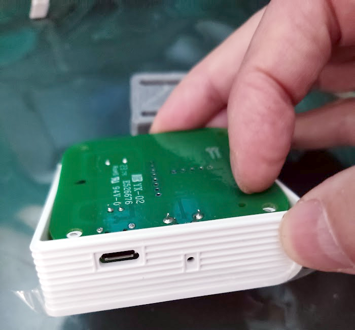
